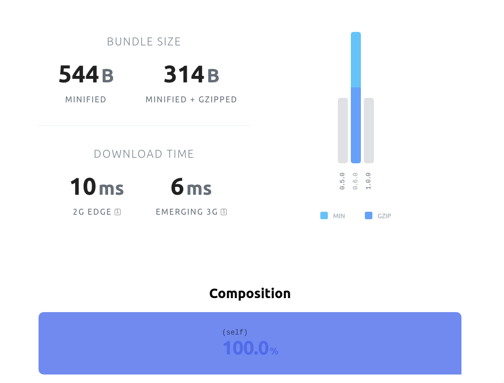

# react-scroll-bottom-hook

> yarn add react-scroll-bottom-hook

## wutdis

when you have legal doc and you want to check if user had scrolled to the bottom, this will solve your problem. Here's how:

```tsx
import useScrollBottom from 'react-scroll-bottom-hook'

export default function Welcome() {
  const [isBottom, scrollRef ] = useScrollBottom()

  return (
    <div>
      {/* Some super long component her with overflow-y: scroll. attach the ref:*/}
      <div
        style={{overflowY:'scroll'}}
        ref={scrollRef} 
        >
        {state.welcome.privacyPolicy.contents}
      </div>
      {/* The isBottom state is handled from the library. Use this to disable the button. */}
      <button disabled={!isBottom}>    
        Looks Good! I have Read and Agreed to this Privacy Policy.
      </button>
    </div>
  )
}

```

## size

https://bundlephobia.com/result?p=react-scroll-bottom-hook@0.6.0



## license

unlicensed, use it how u want xd

## maintainers

+ [louis](https://twitter.com/litbid)
